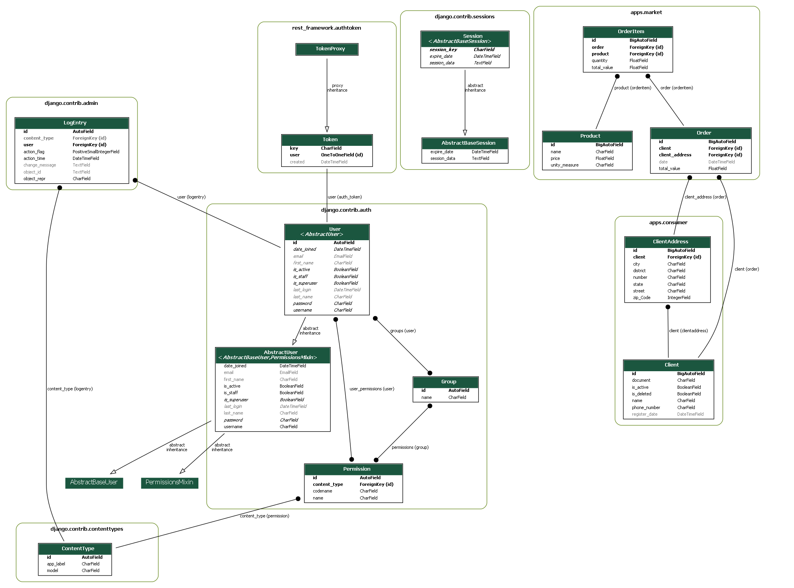

# Passo a Passo para Execução do projeto

### Pré-requisitos

-   Python 3.x instalado em seu sistema.
-   Git instalado em seu sistema.
-   PostgreSQL ou MongoDB instalado no sistema.

### Passo 1: Clonar o Repositório

1.  Abra o terminal ou prompt de comando.
2.  Navegue até o diretório onde deseja clonar o repositório do projeto.
3.  Execute o seguinte comando para clonar o repositório:

```bash
git clone https://github.com/GersonVs/dataFlex.git
```

### Passo 2: Instalar a Virtual Environment

1.  Navegue até o diretório do projeto clonado no terminal ou prompt de comando.
2.  Crie uma virtual environment usando o seguinte comando:

```bash
python -m venv venv
```

Isso criará uma virtual environment chamada "venv" no diretório do projeto.

3. Ative a virtual environment de acordo com o sistema operacional:

-   windows: `venv\Scripts\activate`
-   macOS/Linux: `source venv/bin/activate`

### Passo 3: Instalar Dependências

1. Com a virtual environment ativada, instale as dependências do projeto usando o comando abaixo:

```bash
pip install -r requirements.txt
```

Isso instalará todas as dependências listadas no arquivo requirements.txt no ambiente virtual.

### Passo 4: Configurar arquivo de variáveis de ambiente e Banco de Dados.

1. Verifique se você possui o PostgreSQL ou o MongoDB instalado em seu sistema e configurado corretamente com um banco de dados criado.
2. Na raiz do projeto crie um arquivo chamado `.env` e preencha ele seguindo o modelo do arquivo `.env.exemple`
3. Execute os seguintes comandos para criar as tabelas no banco de dados:

```bash
python manage.py makemigrations
```

e depois

```bash
python manage.py migrate
```

### Passo 5: Executar o Projeto Django

1. Execute o seguinte comando para iniciar o servidor de desenvolvimento do Django:

```bash
python manage.py runserver
```

Isso iniciará o servidor de desenvolvimento do Django na porta 8000 por padrão. 2. Abra um navegador web e acesse http://localhost:8000 para visualizar o projeto Django em execução.

# Execução de testes com locust.io

1. Criar um novo usuário pela interface swagger através da rota `/authentication/api/create_user/`
2. Obter o token do usuário através da rota `/authentication/api/token/`
3. Salvar o token do obtido na variável de ambiente **USER_TOKEN_API** arquivo `.env`
4. Executar ou restartar o servidor do projeto na porta 8000 para que a variável seja reconhecida.
5. Em outra aba do terminal executar o servidor do _locust_ com o comando `locust -f ./test/locustfile.py`
6. Acessar a interface do _locust_ no host http://localhost:8089/
7. Preencher as configurações do teste, e apontar o host para http://localhost:8000
8. Executar o teste.

# Visão geral do projeto.



> A imagem acima mostra uma visão geral da modelagem do banco de dados do projeto.

## Meus contatos 📩

Você pode entrar em contato comigo por meio dos seguintes canais:

-   Email 📧: [gerson.silva@arapiraca.ufal.br](mailto:gerson.silva@arapiraca.ufal.br)
-   Telefone 📞: (82) 9 8204-4603
-   WhatsApp 📲: [+55 (82) 9 8204-4603](https://wa.me/+5582982044603)
-   LinkedIn 💼: [Gerson Vieira](https://www.linkedin.com/in/gerson-vieira/)
-   Twitter 🐦: [@G3R5ON_Vs](https://twitter.com/G3R5ON_Vs)
